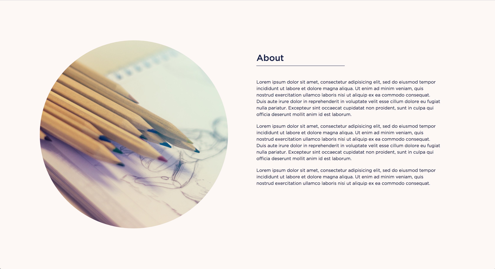
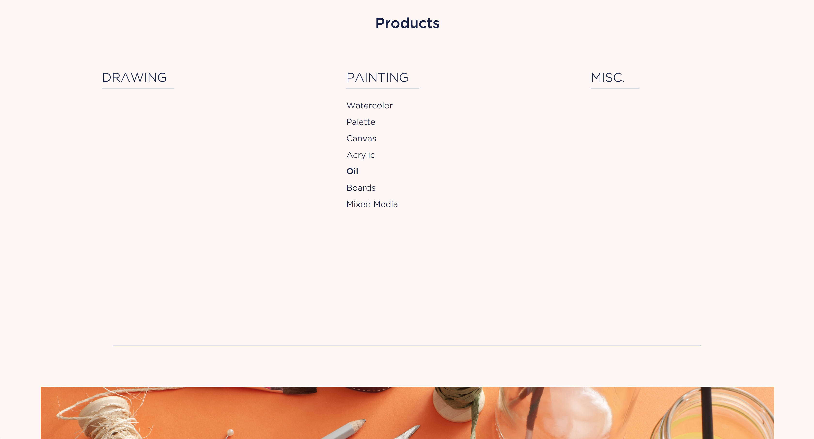
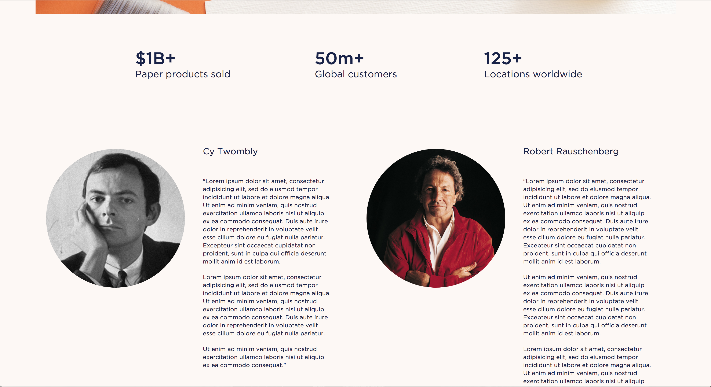
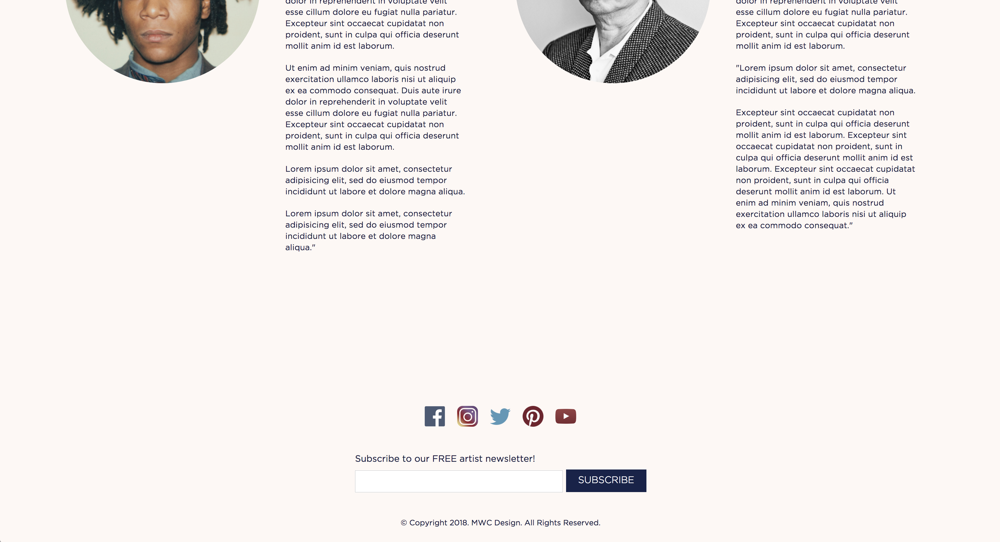

# Paper Cuts Co.

One page website for a fictional paper company.

## Objectives

Demonstrate an understanding of semantic HTML, proper element targeting in CSS, behavioral javascript, animations and understanding the website user.

## Built With

* HTML
* CSS
* Javascript
* Normalize.css

## Authors

* **Michael Chung**

## License

This project is licensed under the MIT License - see the [LICENSE.md](LICENSE.md) file for details

## Acknowledgments

* NYCDA
* Instructor: Oggi Danailov
